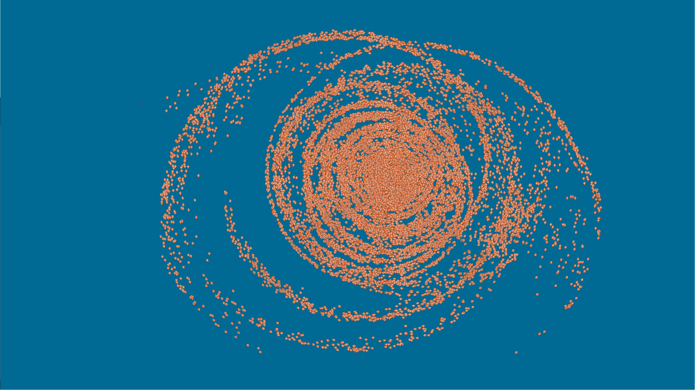

# CUDA Boid flock simulation

Project created for Graphic Processors in Computational Applications classes at the Warsaw University of Technology. 

It utilizes CUDA technology in order to simulate two dimensional flocking movement of large amount of objects (so called _boids_).

## Technology and requirements
Project developed using __C++__ with __SDL__ library and __CUDA__ technology for GPU accelerated computations.

Requirements:
- Windows 10 x64
- CUDA Toolkit 10.2
- Visual Studio 2019

## Purpose
Original purpose of proposed solution was simulation of large fish shoals in 2D.

Although, by updating _\boid-flock-simulation\boid.png_ file, different objects can be used.

## Adjustments
Numerous parameters can be adjusted in order to test the project according to personal use.
All of them can be found in _includes.h_ file:
- __USE_GPU__ - flag indicating whether computations should be accelerated by GPU, by default _true_
- __WINDOW_HEIGHT__, __WINDOW_WIDTH__ - dimensions of rendering area, by default _1440x2560 (2k)_
- __BOID_SIZE__ - size of a single boid, by default _16_
- __SIGHT_RANGE__ - sight range of a single boid (boids outside this radius are ignored from one boid's perspective), by default _700_
- __BOID_COUNT__ - number of boids, by default _20000_
- __MAX_SPEED__ - max boid's speed, by default _9_

## Sources
- _Reynolds, Craig. (2000). Interaction with Groups of Autonomous Characters. Game Developers Conference. 21._ [link](https://www.researchgate.net/publication/2358480_Interaction_with_Groups_of_Autonomous_Characters)
- _Reynolds, Craig W. (1987). Flocks, herds and schools: A distributed behavioral model. SIGGRAPH Comput. Graph. 21, 4 (July 1987), 25–34. DOI: https://doi.org/10.1145/37402.37406_
